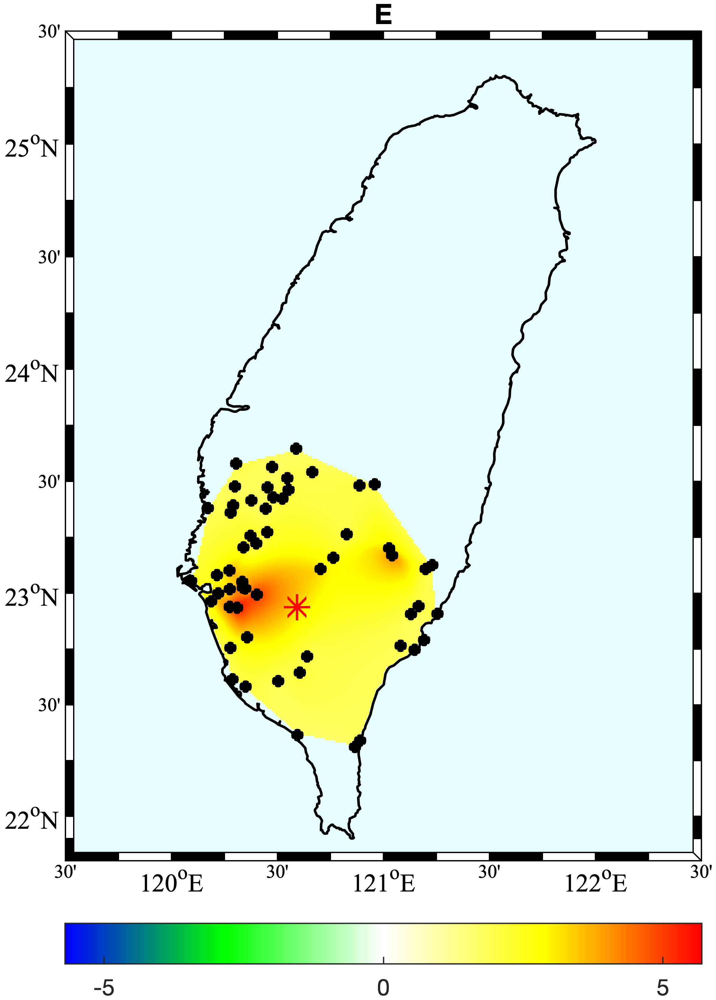

# Least-Squares Modeling and Empirical Orthogonal Functions analysis for the Meinong Earthquake, Taiwan

## Author

- **Utpal Kumar**,
  Post-doctoral researcher,
  Institute of Earth Sciences,
  Academia Sinica,
  Taipei, Taiwan
  @2020/12
  Email: utpalkumar50@gmail.com

## General Information

- All the scripts in the bin directory
- All the results in the Results directory
- Summary of the analysis in Results/summary.txt

---

## Preprocessing

Script: [`check_data_length.py`](bin/1Preprocessing/check_data_length.py)

### Requirements

- TimeSeriesReleased1993.01.01_2018.04.30 (Obtained from the [GPS lab of IES, Academia Sinica](http://gps.earth.sinica.edu.tw))
- [bin/Preprocessing/new_station_info.txt](bin/Preprocessing/new_station_info.txt)
- [bin/Preprocessing/analysis_support.py](bin/Preprocessing/analysis_support.py)

### Purpose

- store the start, end time and number of points in the time series for each stations in dataInspection.txt file
- visualizing the data length by histogram (set vizhist = 1 in the script below) and output `s_e_timeHistogram.png`
- select the data based on the start and end time and copy it into new directory, `SelectedData`
- cut the time series using the start and end time and removing the 2 sigma outliers
- resampling the data for each day and interpolating for unavailable entries
- removing the stations with NaNs (comes from large gaps in interpolation scheme)
- select stations within 50 km from the EQ
- write the selected stations information in [`stn_loc.txt`](Results/stn_loc.txt)
- store data in pickle format and mat format separately for dN, dE, and dU for easy read in other scripts: dU_data.[pickle,mat]

---

## Least Squares Modeling

Script: [`leastSquareModeling.py`](bin/LSQ/leastSquareModeling.py)

### Requirements

- bin/LSQ/least_squares_modules.py
- bin/LSQ/least_squares_plot.py
- Results/stn_loc.txt
- Results/d[U,N,E]\_data.pickle
- bin/Preprocessing/analysis_support.py

### Purpose

- Least squares model to remove the tidal and seasonal signals as well as co-seismic jumps
- Earthquakes selected are obtained from [wilber 3 web interface](https://ds.iris.edu/wilber3/find_event)
- Co-seismic jumps from all earthquakes (>5.1 Mw) except 2016-02-05 computed and removed: Results/SigEarthquakes.txt
- residual results are saved in Results/resd_dU.pickle
- lsq plot are saved at Results/LSQfigs

---

## Topographic Map: bin/TopographicMap

- uses [pyGMT](https://www.pygmt.org/latest/)

  

---

## EOF results: bin/EOF_Analysis

- Run this script (MATLAB code): [`P2plotting_eof_new.m`](bin/EOF_Analysis/P2plotting_eof_new.m) for computing EOF
- Perform the EOF analysis on the selected time series
- Interpolate the EOF results at each station
- EOF results - spatial and temporal - stored at Results/EOFresults
- Variance explained by the two modes: [EOF_modes_VE.txt](Results/EOFresults/EOF_modes_VE.txt)
- The results are normalized with respect to the standard deviation. We divide the spatial pattern with the standard deviation and the corresponding time series, or PCs, are scaled by multiplying by the same normalization value, transferring the magnitude information of eigenvectors into the PCs, which hence has the same unit as the data (millimeter in our study)
- Note the spatial pattern of the first mode: Common mode error (CME)

  
  
  

  
  
  

- Second Mode EOF spatial pattern:

  
  
  

  
  
  

- Plot the EOF time series of the two modes using: `bin/EOF_Analysis/plotting_time_series.py`

---

## Remove CME from time series data at each station: bin/CMEremoval

- subtract the EOF mode 1 pc (CME) from the original time series at each station
- stored in Results/EOFresults/final\_[U,N,E].txt

---

## If you use the script, please cite:

Kumar, U., Chao, B. F., & Chang, E. T. Y. (2020). What causes the common‐mode error in array GPS displacement fields: Case study for Taiwan in relation to atmospheric mass loading. Earth and Space Science, 7, e2020EA001159. https://doi.org/10.1029/2020EA001159
